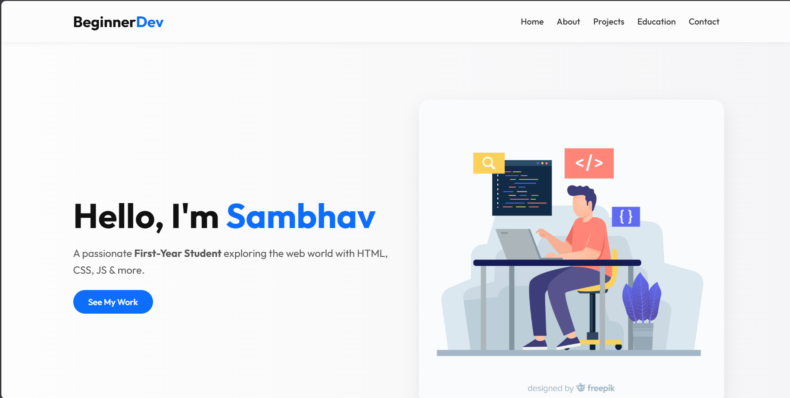

# 👨‍💻 Sambhav Raghuvanshi — Personal Portfolio Website

Welcome to the source code of my **personal portfolio website**, crafted to showcase my journey as a Computer Science student with a passion for **AI/ML**, **web development**, and innovative problem-solving.

This site is a reflection of my skills, projects, and personality — built using only **HTML**, **CSS**, and **JavaScript**, demonstrating my ability to build elegant, responsive designs without relying on heavy frameworks.



---

## 📁 Project Structure

```
sambhavraghuvanshi-prodigy_wd_04/
├── index.html               # Homepage - intro, projects, contact, etc.
├── style.css                # All custom styles
├── script.js                # Basic interactivity (menu, scroll effects, etc.)
└── pics/
    └── appointment-booking-design_23-2148557730.avif  # Hero/Preview Image
```

---

## ✨ Key Highlights

- 💼 **Professional Introduction**: A concise yet impactful bio section that tells who I am.
- 🛠️ **Project Showcase**: Highlights of my best work with potential links to live demos or GitHub repos.
- 📱 **Responsive Design**: Mobile-friendly layout for recruiters or visitors on any device.
- 📫 **Contact Section**: Direct call-to-action for connecting or hiring.

---

## 🛠️ Technologies Used

| Tech        | Description                             |
|-------------|-----------------------------------------|
| HTML5       | Semantic structure and layout            |
| CSS3        | Modern styling using Flexbox & media queries |
| JavaScript  | Simple interactions (e.g., menu toggles)  |

---

## 🔧 Setup Instructions

1. **Clone the Repository**

```bash
git clone https://github.com/sambhavraghuvanshi/sambhavraghuvanshi-prodigy_wd_04.git
cd sambhavraghuvanshi-prodigy_wd_04
```

2. **Open the Site**

Simply open the `index.html` file in your preferred browser:

```
Right-click > Open with > Browser
```

No frameworks, compilers, or servers required.

---

## 📈 Future Plans

- Add **interactive project filters** using JavaScript
- Implement a **dark mode toggle**
- Include a **blog section** or thought pieces
- Expand it into a React or Next.js SPA for scalability

---

## 👤 About Me

**Sambhav Raghuvanshi**  
🎓 B.Tech in Computer Science (AI/ML Specialization)  
💡 Passionate about building intelligent, impactful web solutions  
🌟 Inspired by creators like **Mark Zuckerberg**

Connect with me:  
- 💼 [LinkedIn](#) *(www.linkedin.com/in/sambhav-raghuvanshi-843670372)*
- 💻 [GitHub](https://github.com/sambhavraghuvanshi)  
- ✉️ Email: *sambbhavraghuvanshi17@gmail.com*

---

## 📄 License

This project is licensed under the **MIT License** — feel free to use the structure or design for inspiration with credit.

---

> “Your personal website is your digital handshake — make it count.” 💡
